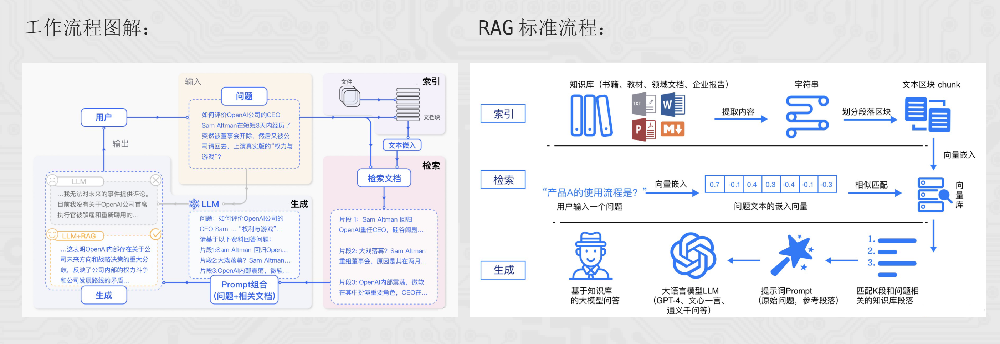
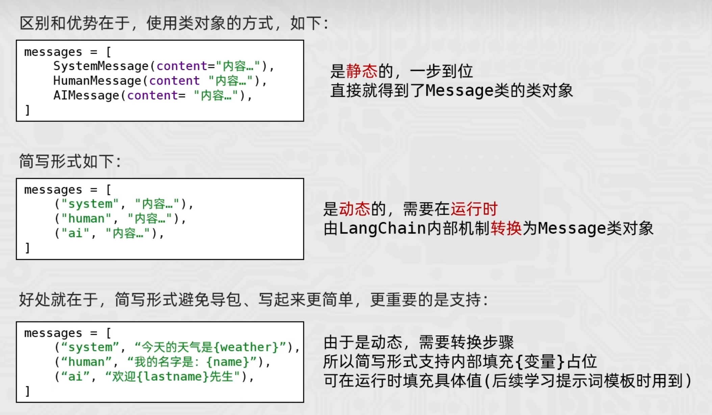

# AI大模型


## ollama

### 常用命令

```bash
#运行模型 
ollama run <模型名称>
# 删除模型
ollama rm <模型名称>
# 查看正在运行的模型
ollama ps
# 更新模型
ollama pull <模型名称>
# 查看已安装的模型
ollama list
```

### 模型选择

| 模型规模 | CPU 核心数 | 内存 (RAM) | 硬盘空间 | 显存 (VRAM)        | 适用场景                   |
| :------- | :--------- | :--------- | :------- | :----------------- | :------------------------- |
| **1.5B** | 最低 4 核  | 8GB+       | 3GB+     | 非必需 (可选 4GB+) | 低资源设备部署             |
| **7B**   | 8 核以上   | 16GB+      | 8GB+     | 推荐 8GB+          | 本地开发、测试             |
| **8B**   | 略高于 7B  | 16GB+      | 8GB+     | 推荐 8GB+          | 高精度轻量级任务           |
| **14B**  | 12 核以上  | 32GB+      | 15GB+    | 16GB+              | 企业级复杂任务             |
| **32B**  | 16 核以上  | 64GB+      | 30GB+    | 24GB+              | 高精度专业领域任务         |
| **70B**  | 32 核以上  | 128GB+     | 70GB+    | 需多卡并行         | 科研机构、高复杂度生成任务 |

**备注：** 以上需求为常规部署参考，实际需求可能因量化精度（如 4-bit, 8-bit 等）及推理框架的不同而有所浮动。


## OpenAI库的基础使用

### 基础使用

```python
from openai import OpenAI

# 获取客户端对象
client:OpenAI = OpenAI(
api_key = "xxx",  # 模型服务商提供的APIKEY密钥，一般写入环境变量，避免泄露
base_url="xxx"   # 模型服务商的API接入地址，用于切换不同的模型或服务商
)

# 调用模型
response:Chatcompletion = client.chat.completions.create(

	model = "xxx",  # 用于选择模型
    messages = [
        {"role":"system", "content":"xxx"},
        {"role":"assistant", "content":"xxx"},
        {"role":"user", "content":"xxx"}
    ]
)  # 给模型提供消息
# system 角色：设定助手的整体行为、角色和规则，为对话提供上下文框架
# assistant 角色：代表 AI 助手的回答，可以在代码中人为设定
# ueser 角色：代表用户，发送提问、指令或需求


# 结果处理
print(response.choices[0].message.content)  # 仅输出回复内容

print(response.model_dump_json(indent=2))  
# 以json格式输出ChatCompletion对象内容
# indent控制json文本的缩进字符，默认None(即非格式化)

```

| **属性名**              | **描述**                                   | **取值方式（代码示例）**              |
| ----------------------- | ------------------------------------------ | ------------------------------------- |
| **`id`**                | 本次请求的唯一标识符，可用于追踪日志。     | `response.id`                         |
| **`choices`**           | **最核心部分**。包含 AI 生成结果的列表。   | `response.choices`                    |
| **`content`**           | **AI 的具体回复文本**。位于第一个选项中。  | `response.choices[0].message.content` |
| **`role`**              | 消息角色（通常为 `assistant`）。           | `response.choices[0].message.role`    |
| **`finish_reason`**     | 生成停止的原因（如 `stop` 代表正常结束）。 | `response.choices[0].finish_reason`   |
| **`model`**             | 实际使用的模型名称及版本。                 | `response.model`                      |
| **`usage`**             | **Token 统计**。包含输入、输出及总计。     | `response.usage`                      |
| **`prompt_tokens`**     | 用户输入（提示词）所消耗的 Token 数。      | `response.usage.prompt_tokens`        |
| **`completion_tokens`** | AI 生成回复（补全）所消耗的 Token 数。     | `response.usage.completion_tokens`    |
| **`total_tokens`**      | 本次对话的总消耗（前两者之和）。           | `response.usage.total_tokens`         |
| **`created`**           | 回复生成的 Unix 时间戳（秒）。             | `response.created`                    |

### 调用本地ollama

```python
# 获取客户端对象
client = OpenAI(
    api_key="",
    base_url="http://localhost:11434/v1"
)

# 调用模型
response = client.chat.completions.create(

    model="gemma3:1b",  # 用于选择模型
    messages = [
        {"role": "system", "content": "你是一个说中文的助手"},
        {"role": "assistant", "content": "好的"},
        {"role": "user", "content": "请介绍下自己"}
]
)

# 输出结果
print(response.choices[0].message.content)
```

###  流式输出（推荐）

```python
from openai import OpenAI

# 获取客户端对象
client:OpenAI = OpenAI(api_key = "xxx",  base_url="xxx"  )

# 调用模型
response:Chatcompletion = client.chat.completions.create(
	model = "xxx",
    messages = [
        {"role":"system", "content":"xxx"},
        {"role":"assistant", "content":"xxx"},
        {"role":"user", "content":"xxx"}
    ],
    stream = true  # 开启流式输出功能
)

# 结果处理
for chunk in response:
    if chunk.choices[0].delta.content:
        print(chunk.choices[0].delta.content, end='', flush=True)
        # flush 立刻刷新缓冲区
```


## In-Context Prompting（提示词工程）

### Zero-shot Learning

模型训练层面：零样本，基于模型训练阶段学习的属性/语义关联，去迁移到未知的新类别。

提示词优化层面：无提示，语言描述任务，依赖模型预训练知识回答。

### Few-shot learning

模型训练层面：少样本，基于少量样本，快速泛化识别新样本。

提示词优化层面：给与模型少量示例，引导模型对齐示例输出结果。


## 提示词工程案例

### LLM 实现金融文本分类

```python
from openai import OpenAI

# 示例数据
examples_data = {
    '新闻报道': '今日，股市经历了一轮震荡，受到宏观经济数据和全球贸易紧张局势的影响。投资者密切关注美联储可能的政策调整，以适应市场的不确定性。',
    '财务报告': '本公司年度财务报告显示，去年公司实现了稳步增长的盈利，同时资产负债表呈现强劲的状况。经济环境的稳定和管理层的有效战略执行为公司的健康发展奠定了基础。',
    '公司公告': '本公司高兴地宣布成功完成最新一轮并购交易，收购了一家在人工智能领域领先的公司。这一战略举措将有助于扩大我们的业务领域，提高市场竞争力',
    '分析师报告': '最新的行业分析报告指出，科技公司的创新将成为未来增长的主要推动力。云计算、人工智能和数字化转型被认为是引领行业发展的关键因素，投资者应关注这些趋势'
}
# 分类列表
examples_types = ['新闻报道', '财务报道', '公司公告', '分析师报告']

# 生成 messages_original
messages_original = [
    {"role": "system",
     "content": f"你是金融专家，将文本分类为{str(examples_types)}，不清楚的分类为'不清楚类别' 下面有示例："},
]

for key, value in examples_data.items():
    messages_original.append({"role": "user", "content": value})
    messages_original.append({"role": "assistant", "content": key})

# 提问数据
questions = [
    "今日，央行发布公告宣布降低利率，以刺激经济增长。这一降息举措将影响贷款利率，并在未来几个季度内对金融市场产生影响。",
    "ABC公司今日发布公告称，已成功完成对XYZ公司股权的收购交易。本次交易是ABC公司在扩大业务范围、加强市场竞争力方面的重要举措。据悉，此次收购将进一步巩固ABC公司在行业中的地位，并为未来业务发展提供更广阔的发展空间。详情请见公司官方网站公告栏",
    "公司资产负债表显示，公司偿债能力强劲，现金流充足，为未来投资和扩张提供了坚实的财务基础。",
    "最新的分析报告指出，可再生能源行业预计将在未来几年经历持续增长，投资者应该关注这一领域的投资机会",
    "小明喜欢小新哟"
]

# 调用 LLM
client = OpenAI(api_key="", base_url="http://localhost:11434/v1")
for q in questions:
    messages = messages_original + [{"role": "user", "content": f"按照示例，回答这段文本的分类类别：{q}"}]
    response = client.chat.completions.create(model="gemma3:1b",messages = messages)
    print(response.choices[0].message.content)
```

###  LLM 实现金融信息抽取

```python
from openai import OpenAI
import json

# 示例数据
schema = ['日期', '股票名称', '开盘价', '收盘价', '成交量']
examples_data = [
    {
        "content": "2023-01-10，股市震荡。股票强大科技A股今日开盘价100人民币，一度飙升至105人民币，随后回落至98人民币，最终以102人民币收盘，成交量达到520000。",
        "answers": {
            "日期": "2023-01-10",
            "股票名称": "强大科技A股",
            "开盘价": "100人民币",
            "收盘价": "102人民币",
            "成交量": "520000"
        }
    },
    {
        "content": "2024-05-16，股市利好。股票英伟达美股今日开盘价105美元，一度飙升至109美元，随后回落至100美元，最终以116美元收盘，成交量达到3560000。",
        "answers": {
            "日期": "2024-05-16",
            "股票名称": "英伟达美股",
            "开盘价": "105美元",
            "收盘价": "116美元",
            "成交量": "3560000"
        }
    }
]

# 生成 messages_original
messages_original = [
    {"role": "system",
     "content": f"你帮我完成信息抽取，我给你句子，你抽取{schema}信息，按JSON字符串输出，如果某些信息不存在，用'原文未提及'表示，请参考如下示例："}
]

for example in examples_data:
    messages_original.append({"role": "user", "content": example["content"]})
    messages_original.append({"role": "assistant", "content": json.dumps(example["answers"], ensure_ascii=False)})

# 提问数据
questions = [
    "2025-06-16，股市利好。股票传智教育A股今日开盘价66人民币，一度飙升至70人民币，随后回落至65人民币，最终以68人民币收盘，成交量达到123000。",
    "2025-06-06，股市利好。股票黑马程序员A股今日开盘价200人民币，一度飙升至211人民币，随后回落至201人民币，最终以206人民币收盘。"
]

# 调用 LLM
client = OpenAI(api_key="", base_url="http://localhost:11434/v1")
for q in questions:
    messages = messages_original + [{"role": "user", "content": f"按照上述的示例，现在抽取这个句子的信息：{q}"}]
    response = client.chat.completions.create(model="gemma3:1b", messages=messages)
    print(response.choices[0].message.content)

```

### LLM 实现金融文本匹配

```python
from openai import OpenAI

# 示例数据
examples_data = {
    "是": [
        ("公司ABC发布了季度财报，显示盈利增长。", "财报披露，公司ABC利润上升。"),
        ("公司ITCAST发布了年度财报，显示盈利大幅度增长。", "财报披露，公司ITCAST更赚钱了。")
    ],
    "不是": [
        ("黄金价格下跌，投资者抛售。", "外汇市场交易额创下新高。"),
        ("央行降息，刺激经济增长。", "新能源技术的创新。")
    ]
}
# 生成 messages_original
messages_original = [
    {"role": "system",
     "content": f"你帮我完成文本匹配，我给你2个句子，被[]包围，你判断它们是否匹配，回答是或不是，请参考如下示例："},
]

for key, value in examples_data.items():
    for t in value:
        messages_original.append(
            {"role": "user", "content": f"句子1：[{t[0]}]，句子2：[{t[1]}]"}
        )
        messages_original.append(
            {"role": "assistant", "content": key}
        )
# 提问数据
questions = [
    ("利率上升，影响房地产市场。", "高利率对房地产有一定的冲击。"),
    ("油价大幅度下跌，能源公司面临挑战。", "未来智能城市的建设趋势越加明显。"),
    ("股票市场今日大涨，投资者乐观。", "持续上涨的市场让投资者感到满意。")
]

# 调用 LLM
client = OpenAI(api_key="", base_url="http://localhost:11434/v1")
for q in questions:
    messages = messages_original + [{"role": "user", "content": f"句子1：[{q[0]}]，句子2：[{q[1]}]"}]
    response = client.chat.completions.create(model="gemma3:1b", messages=messages)
    print(response.choices[0].message.content)
```


## RAG 开发

RAG（Retrieval-Augmented Generation），即检索增强生成，为 LLM 提供了从特定数据源检索到的信息，以此来修正和补充生成的答案。

RAG = 检索技术 + LLM 提示

> 通用大模型存在的问题：
>
> 1. LLM 的知识不是实时的。模型训练好后不具备自动更新知识的能力，会导致部分信息滞后。
> 2. LLM 领域知识是缺乏的。大模型的知识来源于训练数据，无法覆盖特定领域或高度专业化的内部知识。
> 3. 幻觉问题。LLM有时会在回答中生成看似合理但实际上是错误的信息。
> 4. 数据安全性。




## LangChain库

LangChain支持三种类型的模型：LLMs（大语言模型）、Chat Models（聊天模型）、Embedings Models（嵌入模型）。

| 方式            | LLMs大语言模型                                     | 聊天模型                                                     | 文本嵌入模型                                                 |
| --------------- | -------------------------------------------------- | ------------------------------------------------------------ | ------------------------------------------------------------ |
| 阿里云 千问     | from langchain_community.llms.tongyi import Tongyi | from langchain_community.chat_models.tongyi import ChatTongyi | from langchain_community.embeddings import DashScopeEmbeddings |
| Ollama 本地模型 | from langchain_ollama import OllamaLLM             | from langchain_ollama import ChatOllama                      | from langchain_ollama import OllamaEmbeddings                |
| 方法            | `invoke` 批量 / `stream` 流式                      | `invoke` 批量 / `stream` 流式                                | `embed_query` 单次转换 / `embed_documents` 批量转换          |

### 调用LLMs

```python
from langchain_ollama import OllamaLLM

# 创建模型对象
model = OllamaLLM(model="gemma3:1b")

# 调用模型
res = model.invoke(input="你是谁")

# 输出结果
print(res)
```

### 流式输出（推荐）

```python
# invoke方法：一次性返回完整结果
# stream方法：流式输出

from langchain_ollama import OllamaLLM

# 创建模型对象
model = OllamaLLM(model="gemma3:1b")

# 调用模型
res = model.stream(input="你是谁")

# 输出结果
for chunk in res:
    print(chunk, end='', flush=True)
```

### 调用Chat Model

聊天消息包含三种类型：

* AIMessage：AI输出的消息（OpenAI库中assistant角色）。
* HumanMessage：用户消息（OpenAI库中user角色）。
* SystemMessage：指定模型具体所处的环境和背景（OpentAI库中system角色）。

```python
from langchain_ollama import ChatOllama
from langchain_core.messages import HumanMessage, AIMessage, SystemMessage

# 创建模型对象
model = ChatOllama(model="gemma3:1b")

# 创建消息列表
messages = [
    SystemMessage(content="你是一个边塞诗人。"),
    HumanMessage(content="写一首唐诗"),
    AIMessage(content="锄禾日当午，汗滴禾下土，谁知盘中餐，粒粒皆辛苦。"),
    HumanMessage(content="按照你上一个回复的格式，在写一首唐诗。")
]

# 调用stream流式执行
res = model.stream(input=messages)

# for循环迭代打印输出，通过.content来获取到内容
for chunk in res:
    print(chunk.content, end="", flush=True)
```

### 简化的消息列表



```python
from langchain_ollama import ChatOllama
from langchain_core.messages import HumanMessage, AIMessage, SystemMessage

# 创建模型对象
model = ChatOllama(model="gemma3:1b")

# 创建消息列表
messages = [
    # (角色, 内容) 角色：system/human/ai
    ("system", "你是一个边塞诗人。"),
    ("human", "写一首唐诗"),
    ("ai", "锄禾日当午，汗滴禾下土，谁知盘中餐，粒粒皆辛苦。"),
    ("human", "按照你上一个回复的格式，在写一首唐诗。")
]

# 调用stream流式执行
res = model.stream(input=messages)

# for循环迭代打印输出，通过.content来获取到内容
for chunk in res:
    print(chunk.content, end="", flush=True)
```

### 调用Embedings Models

```python
from langchain_ollama import OllamaEmbeddings

model = OllamaEmbeddings(model="embeddinggemma")

# embed_query、embed_documents
print(model.embed_query("我喜欢你"))
print(model.embed_documents(["我喜欢你", "我稀饭你", "晚上吃啥"]))
```


## 基于LangChain的提示词模板

PromptTemplate用于创建自定义的基础提示词模板，支持变量的注入，最终生成所需的提示词。

### 通用的prompt(zero-shot)

```python
from langchain_core.prompts import PromptTemplate
from langchain_ollama import OllamaLLM

# zero-shot
# 创建提示词模板
prompt_template = PromptTemplate.from_template(
    "我的邻居姓{lastname}, 刚生了{gender}, 你帮我起个名字，简单回答。"
)

# 调用.format方法注入信息
prompt_text = prompt_template.format(lastname="张", gender="女儿")

model = OllamaLLM(model="gemma3:1b")
res = model.invoke(input=prompt_text)
print(res)
```

### 基于chain链的写法(zero-shot)

```python
from langchain_core.prompts import PromptTemplate
from langchain_ollama import OllamaLLM

# zero-shot
# 创建提示词模板
prompt_template = PromptTemplate.from_template(
    "我的邻居姓{lastname}, 刚生了{gender}, 你帮我起个名字，简单回答。"
)
model = OllamaLLM(model="gemma3:1b")
chain = prompt_template | model

res = chain.invoke(input={"lastname": "张", "gender": "女儿"})
print(res)
```

### 通用的prompt(few-shot)

```python
from langchain_core.prompts import PromptTemplate, FewShotPromptTemplate
from langchain_ollama import OllamaLLM

# few-shot
# 提示词模板
example_template = PromptTemplate.from_template("单词：{word}, 反义词：{antonym}")

# 示例数据 list内部套字典
examples_data = [
    {"word": "大", "antonym": "小"},
    {"word": "上", "antonym": "下"},
]

few_shot_template = FewShotPromptTemplate(
    example_prompt=example_template,    # 示例数据的模板
    examples=examples_data,             # 示例的数据（用来注入动态数据的），list内套字典
    prefix="告知我单词的反义词，我提供如下的示例：",                   # 示例之前的提示词
    suffix="基于前面的示例告知我，{input_word}的反义词是？",          # 示例之后的提示词
    input_variables=['input_word']      # 声明在前缀或后缀中所需要注入的变量名
)

prompt_text = few_shot_template.invoke(input={"input_word": "左"}).to_string()

model = OllamaLLM(model="gemma3:1b")
print(model.invoke(input=prompt_text))
```

## RAG 项目


## Agent 智能体


# AI大模型应用开发


