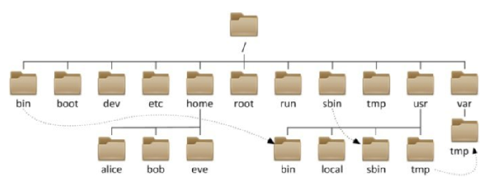

# Linux


## Linux相关概念

### 文件目录

- Linux只有一个顶级目录：`/` 根目录
- 路径描述的层级关系用`/`来表示



#### HOME目录

每一个用户在Linux系统中都有自己的专属工作目录，称之为HOME目录。

- 普通用户的HOME目录，默认在：`/home/用户名`

- root用户的HOME目录，在：`/root`


#### 相对路径、绝对路径

- 相对路径，非`/`开头的称之为相对路径

  相对路径表示以`当前目录`作为起点，去描述路径，如`test/a.txt`，表示当前工作目录内的test文件夹内的a.txt文件

- 绝对路径，以`/`开头的称之为绝对路径

  绝对路径从`根`开始描述路径


#### 特殊路径符

- `.` 表示当前，比如./a.txt，表示当前文件夹内的 a.txt 文件
- `..` 表示上级目录，比如`../`表示上级目录，`../../`表示上级的上级目录
- `~` 表示用户的HOME目录，比如`cd ~`，即可切回用户HOME目录


### ip地址

格式：a.b.c.d

- abcd为0~255的数字


特殊IP：

- 127.0.0.1，表示本机
- 0.0.0.0
  - 可以表示本机
  - 也可以表示任意IP（看使用场景）


查看ip：`ifconfig`


### 主机名

功能：Linux系统的名称

查看：`hostname`

设置：`hostnamectl set-hostname 主机名`


### PATH变量

记录了执行程序的搜索路径

可以将自定义路径加入PATH内，实现自定义命令在任意地方均可执行的效果


#### $符号

功能：取出指定的环境变量的值

语法：`$变量名`

示例：

`echo $PATH`，输出PATH环境变量的值

`echo ${PATH}ABC`，输出PATH环境变量的值以及ABC

* 如果变量名和其它内容混淆在一起，可以使用${}


#### 设置环境变量

- 临时设置：export 变量名=变量值
- 永久设置：
  - 针对用户，设置用户HOME目录内：`.bashrc`文件
  - 针对全局，设置`/etc/profile`

#### env命令

查看系统全部的环境变量

语法：`env`


## 常用命令

### ls命令

功能：列出文件夹信息

语法：`ls [-l -h -a] [参数]`

- 参数：被查看的文件夹，不提供参数，表示查看当前工作目录
- -l，以列表形式查看
- -h，配合-l，以更加人性化的方式显示文件大小
- -a，显示隐藏文件（在Linux中以`.`开头的文件）


### pwd命令

功能：展示当前工作目录

语法：`pwd`


### cd命令

功能：切换工作目录

语法：`cd [目标目录]`

参数：目标目录，要切换去的地方，不提供默认切换到`当前登录用户HOME目录`


### mkdir命令

功能：创建文件夹

语法：`mkdir [-p] 参数`

- 参数：被创建文件夹的路径
- 选项：-p，可选，表示创建前置路径


### touch命令

功能：创建文件

语法：`touch 参数`

- 参数：被创建的文件路径


### cat命令

功能：查看文件内容

语法：`cat 参数`

- 参数：被查看的文件路径


### more命令

功能：查看文件，可以支持翻页查看

语法：`more 参数`

- 参数：被查看的文件路径
- 在查看过程中：
  - `空格`键翻页
  - `q`退出查看


### cp命令

功能：复制文件、文件夹

语法：`cp [-r] 参数1 参数2`

- 参数1，被复制的
- 参数2，要复制去的地方
- 选项：-r，复制文件夹使用

示例：

- `cp a.txt b.txt` 复制当前目录下a.txt为b.txt
- `cp a.txt test/` 复制当前目录a.txt到test文件夹内
- `cp -r test test2` 复制文件夹test到当前文件夹内为test2存在


### mv命令

功能：移动文件、文件夹

语法：`mv 参数1 参数2`

- 参数1：被移动的
- 参数2：要移动去的地方，参数2如果不存在，则会进行改名


### rm命令

功能：删除文件、文件夹

语法：`rm [-r -f] 参数...参数`

- 参数：支持同时删除多个，用空格进行分隔
- 选项：-r，删除文件夹使用
- 选项：-f，强制删除，不会给出确认提示，一般root用户会用到

> rm命令很危险，一定要注意，特别是切换到root用户的时候。


### which命令

功能：查看命令的程序本体文件路径

语法：`which 参数`

- 参数：被查看的命令


### find命令

功能：搜索文件

语法：`find 路径 -name 参数`

- 路径，搜索的起始路径
- 参数，搜索的文件名，支持通配符`*`， 比如：`*test` 表示搜索任意以 test 结尾的文件


### grep命令

功能：过滤关键字

语法：`grep [-n] 关键字 文件路径`

- 选项-n，可选，表示在结果中显示匹配的行的行号。
- 参数，关键字，必填，表示过滤的关键字，带有空格或其它特殊符号，建议使用`"`
- 参数，文件路径，必填，表示要过滤内容的文件路径，可作为内容输入端口

> 参数文件路径，可以作为管道符的输入


### wc命令

功能：统计

语法：`wc [-c -m -l -w] 文件路径`

- 选项，-c，统计bytes数量
- 选项，-m，统计字符数量
- 选项，-l，统计行数
- 选项，-w，统计单词数量
- 参数，文件路径，被统计的文件，可作为内容输入端口

> 参数文件路径，可作为管道符的输入


### 管道符`|`

功能：将符号左边的结果，作为符号右边的输入

示例：`cat a.txt | grep itheima`，将cat a.txt的结果，作为grep命令的输入，用来过滤 itheima 关键字

支持嵌套：`cat a.txt | grep itheima | grep itcast`


### echo命令

功能：输出内容

语法：`echo 参数`

- 参数：被输出的内容


### 反引号`` ` `` 

功能：被两个反引号包围的内容，会作为命令执行

示例：`` echo `pwd` ``，会输出当前工作目录


### head命令

功能：查看文件头部内容

语法：`head [-n] 参数`

- 参数：被查看的文件
- 选项：-n，查看的行数


### tail命令

功能：查看文件尾部内容

语法：`tail [-f] 参数`

- 参数：被查看的文件
- 选项：-f，持续跟踪文件修改


### 重定向符

功能：将符号左边的结果，输出到右边指定的文件中去

- `>`，表示覆盖输出
- `>>`，表示追加输出


### vi编辑器

#### 命令模式快捷键

| **模式** | **命令** | **描述**                             |
| -------- | -------- | ------------------------------------ |
| 命令模式 | **i**    | 在当前光标位置进入 输入模式          |
| 命令模式 | **a**    | 在当前光标位置 之后 进入 输入模式    |
| 命令模式 | **I**    | 在当前行的 开头 进入 输入模式        |
| 命令模式 | **A**    | 在当前行的 结尾 进入 输入模式        |
| 命令模式 | **o**    | 在当前光标 下一行 进入 输入模式      |
| 命令模式 | **O**    | 在当前光标 上一行 进入 输入模式      |
| 输入模式 | **esc**  | 任何情况下输入 esc 都能回到 命令模式 |

| **模式** | **命令**            | **描述**               |
| -------- | ------------------- | ---------------------- |
| 命令模式 | **键盘上、键盘 k**  | 向上移动光标           |
| 命令模式 | **键盘下、键盘 j**  | 向下移动光标           |
| 命令模式 | **键盘左、键盘 h**  | 向左移动光标           |
| 命令模式 | **键盘右、键盘 l**  | 向后移动光标           |
| 命令模式 | **0**               | 移动光标到当前行的开头 |
| 命令模式 | **$**               | 移动光标到当前行的结尾 |
| 命令模式 | **pageup (PgUp)**   | 向上翻页               |
| 命令模式 | **pagedown (PgDn)** | 向下翻页               |
| 命令模式 | **/**               | 进入搜索模式           |
| 命令模式 | **n**               | 向下继续搜索           |
| 命令模式 | **N**               | 向上继续搜索           |

| **模式** | **命令**     | **描述**                            |
| -------- | ------------ | ----------------------------------- |
| 命令模式 | **dd**       | 删除光标所在行的内容                |
| 命令模式 | **ndd**      | n 是数字，删除当前行和下面的 n-1 行 |
| 命令模式 | **yy**       | 复制当前行                          |
| 命令模式 | **nyy**      | n 是数字，复制当前行和下面的 n-1 行 |
| 命令模式 | **p**        | 粘贴复制的内容                      |
| 命令模式 | **u**        | 撤销修改                            |
| 命令模式 | **ctrl + r** | 反向撤销修改                        |
| 命令模式 | **gg**       | 跳到首行                            |
| 命令模式 | **G**        | 跳到行尾                            |
| 命令模式 | **dgg**      | 从当前行开始，向上全部删除          |
| 命令模式 | **dG**       | 从当前行开始，向下全部删除          |
| 命令模式 | **d$**       | 从当前光标开始，删除到本行的结尾    |
| 命令模式 | **d0**       | 从当前光标开始，删除到本行的开头    |

#### 底线命令快捷键

| **模式**     | **命令**       | **描述**                                     |
| ------------ | -------------- | -------------------------------------------- |
| 底线命令模式 | **:wq**        | 保存文件并退出编辑器                         |
| 底线命令模式 | **:q**         | 退出编辑器（若文件已修改则会提示无法退出）   |
| 底线命令模式 | **:q!**        | 强制退出，不保存任何修改                     |
| 底线命令模式 | **:w**         | 仅保存当前修改，不退出编辑器                 |
| 底线命令模式 | **:set nu**    | 显示行号（number）                           |
| 底线命令模式 | **:set paste** | 设置粘贴模式（防止从外部粘贴代码时格式乱序） |

### 命令的选项

#### 查看命令的帮助

`命令 --help`：查看命令的帮助手册

#### 查看命令的详细手册

`man 命令`：查看某命令的详细手册


## Linux常用操作

### 软件安装

- CentOS系统使用：
  - yum [install remove search] [-y] 软件名称
    - install 安装
    - remove 卸载
    - search 搜索
    - -y，自动确认
- Ubuntu系统使用
  - apt [install remove search] [-y] 软件名称
    - install 安装
    - remove 卸载
    - search 搜索
    - -y，自动确认

> yum 和 apt 均需要root权限


### systemctl

功能：控制系统服务的启动关闭等

语法：`systemctl start | stop | restart | disable | enable | status 服务名`

- start，启动
- stop，停止
- restart，重启
- disable，关闭开机自启
- enable，开启开机自启
- status，查看状态


### 软链接

功能：创建文件、文件夹软链接（快捷方式）

语法：`ln -s 参数1 参数2`

- 参数1：被链接的
- 参数2：要链接去的地方（快捷方式的名称和存放位置）

| **特性**       | **软链接 (Soft Link)**    | **硬链接 (Hard Link)**               |
| -------------- | ------------------------- | ------------------------------------ |
| **本质**       | 包含路径的快捷方式文件    | 文件的另一个名称（共享同一个 Inode） |
| **跨分区**     | 支持                      | 不支持                               |
| **链接目录**   | 支持                      | 不支持（通常受限）                   |
| **删除原文件** | 链接失效（变成“死链”）    | 文件依然存在，直到所有链接被删除     |
| **命令**       | `ln -s [源文件] [链接名]` | `ln [源文件] [链接名]`               |


### 日期

#### 时区

```bash
# 修改时区为中国时区
rm -f /etc/localtime
sudo ln -s /usr/share/zoneinfo/Asia/Shanghao /etc/localtime
```


#### NTP（网络时间协议）

```bash
# 使用 yum 安装 NTP 软件包，-y 自动跳过确认步骤
sudo yum install -y ntp

# 注意：在运行 ntpd 守护进程之前，通常先进行一次手动校准。
# -u 参数表示使用非特权端口，有助于穿透某些防火墙。
sudo ntpdate -u ntp.aliyun.com

# 启动 ntpd 服务，让它在后台持续微调时间
sudo systemctl start ntpd

# 设置 ntpd 为开机自启动，确保系统重启后时间依然自动同步
sudo systemctl enable ntpd

# 验证服务是否成功运行
sudo systemctl status ntpd

# 使用 ntpq 命令查看当前系统正在与哪些上游服务器同步
ntpq -p
```

```bash
# 在较新的系统中，chrony 通常是默认的时间同步组件
sudo yum install -y chrony

# 修改配置文件 (使用阿里云/清华源加速)
sudo sed -i '1i server ntp.aliyun.com iburst' /etc/chrony.conf
sudo sed -i '2i server ntp.tuna.tsinghua.edu.cn iburst' /etc/chrony.conf

# 启动 Chrony 服务
sudo systemctl start chronyd

# 设置开机自启
sudo systemctl enable chronyd

# 类似于之前的 ntpdate 命令，chronyc 可以强制系统立即步进对齐时间
sudo chronyc makestep

# 5. 检查同步状态 (查看是否有 * 标记)
chronyc sources -v
chronyc tracking
```


#### 获取日期

语法：`date [-d] [+格式化字符串]`

- -d 用于日期计算
  
  | **时间标记**      | **命令示例**                      | **输出示例 (假设当前 2026-04-15)** |
  | ----------------- | --------------------------------- | ---------------------------------- |
  | **year** (年)     | `date -d "+1 year" +%Y-%m-%d`     | 2027-04-15                         |
  | **month** (月)    | `date -d "-1 month" +%Y-%m-%d`    | 2026-03-15                         |
  | **day** (天)      | `date -d "tomorrow" +%Y-%m-%d`    | 2026-04-16                         |
  | **hour** (小时)   | `date -d "+1 hour" +%H:%M:%S`     | 05:05:01                           |
  | **minute** (分钟) | `date -d "-10 minutes" +%H:%M:%S` | 03:55:01                           |
  | **second** (秒)   | `date -d "+30 seconds" +%S`       | 31                                 |
  
- 格式化字符串：通过特定的字符串标记，来控制显示的日期格式
  
  | **占位符** | **说明**        | **取值区间 (数学形式)** | **示例 (2026-04-15)** |
  | ---------- | --------------- | ----------------------- | --------------------- |
  | **%Y**     | 完整年份        | $[0000, 9999]$          | 2026                  |
  | **%y**     | 年份后两位      | $[00, 99]$              | 26                    |
  | **%m**     | 月份            | $[01, 12]$              | 04                    |
  | **%d**     | 一个月中的天数  | $[01, 31]$              | 15                    |
  | **%H**     | 小时 (24小时制) | $[00, 23]$              | 04                    |
  | **%M**     | 分钟            | $[00, 59]$              | 09                    |
  | **%S**     | 秒              | $[00, 60]$              | 01                    |
  | **%s**     | Unix 时间戳     | $[0, +\infty)$          | 1776226141            |


### ps命令

功能：查看进程信息

语法：`ps -ef`，查看全部进程信息，可以搭配grep做过滤：`ps -ef | grep xxx`


### kill命令

语法：`kill [-9] 进程ID`

* 选项：-9，表示强制关闭进程。不使用此选项会向进程发送信号要求其关闭，但是否关闭依据进程自身的处理机制


### nmap命令

功能：查看端口的占用情况

语法：`nmap ip地址`


### netstat命令

功能：查看端口占用

用法：`netstat -anp | grep xxx`


### ping命令

功能：测试网络是否联通

语法：`ping [-c num] 参数`

* 选项：-c，检查的次数，不使用-c选项，将无限次数持续检查
* 参数：ip或主机名，需检查的服务器的ip地址或主机名地址


### wget命令

功能：命令行内下载网络文件

语法：`wget [-b] url`

* 选项：-b，可选，后台下载，会将日志写入到当前工作目录的wget-log文件
* 参数：url，下载链接


### curl命令

功能：发送http网络请求，可用于：下载文件、获取信息等

语法：`curl [-O] url`

* 选项：-O，用于下载文件，当url是下载链接时，可以使用此选项保存文件
* 参数：url，要发起请求的网络地址


### top命令

功能：查看主机运行状态

语法：`top`，查看基础信息


### df命令

功能：查看磁盘占用

语法：`df [-h]`

* 选项：-h，以人性化的单位显示


### 压缩解压

#### 压缩

语法1：`tar -zcvf 压缩包 被压缩1...被压缩2...被压缩N`

- -z表示使用gzip，可以不写


语法2：`zip [-r] 参数1 参数2 参数N`

* 选项：-r，被压缩的包含文件夹时，需要使用-r选项，和rm、cp等命令的-r效果一致


示例：

* `zip test.zip a.txt b.txt c.txt` 将 a.txt b.txt c.txt 压缩到 test.zip 文件内
* `zip -r test.zip test itheima a.txt` 将 text itheima 两个文件夹和 a.txt文件，压缩到test.zip文件内


#### 解压

`tar -zxvf 被解压的文件 -C 要解压去的地方`

- -z表示使用gzip，可以省略
- -C，可以省略，指定要解压去的地方，不写解压到当前目录


`unzip [-d] 参数`


## su命令

切换用户

语法：`su [-] [用户]`


## sudo命令


比如：

```shell
itheima ALL=(ALL)       NOPASSWD: ALL
```

在visudo内配置如上内容，可以让itheima用户，无需密码直接使用`sudo`


## chmod命令

修改文件、文件夹权限


语法：`chmod [-R] 权限 参数`

- 权限，要设置的权限，比如755，表示：`rwxr-xr-x`

  

- 参数，被修改的文件、文件夹

- 选项-R，设置文件夹和其内部全部内容一样生效


## chown命令

修改文件、文件夹所属用户、组


语法：`chown [-R] [用户][:][用户组] 文件或文件夹`


### 用户组管理

以下命令需要 root 用户执行

* 创建用户组：`groupadd 用户组名`
* 删除用户组：`groupdel 用户组名`


### 用户管理

以下命令需要 root 用户执行

* 创建用户：`useradd [-g -d] 用户名` 

  * 选项：-g，指定用户的组（已存在），不指定-g，会创建同名组并自动加入。如已存在同名组，必须使用-g
  * 选项：-d，指定用户HOME路径，不指定，HOME目录默认在：/home/用户名

* 删除用户：`userdel [-r] 用户名`

  * 选项：-r，删除用户的HOME目录，不使用-r，删除用户时，HOME目录保留

* 查看用户所属组：`id [用户名]`

  * 参数：用户名，被查看的用户，默认查看自身

  修改用户所属组：`usermod -aG 用户组 用户名`


### genenv命令

- `getenv group`，查看系统全部的用户组

- `getenv passwd`，查看系统全部的用户


