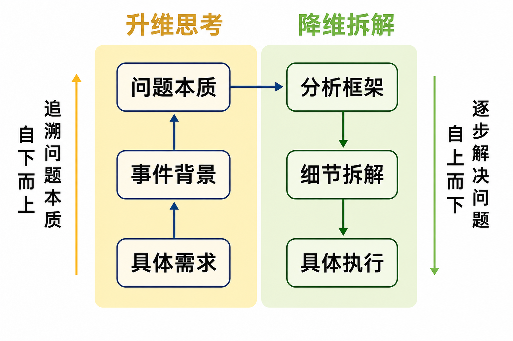

# 数据分析思维

## 数据分析SOP

> 第一部分
>
> 需求挖掘 -> 问题定义 -> 步骤拆解
>
> * 业务知识
> * 逻辑思维
> * 分析方法论
> * 模型原理

> 第二部分
>
> 数据提取 -> 清洗加工 -> 分析/建模
>
> * Excel
> * SQL
> * Python
> * 数学模型
> * 统计知识

> 第三部分
>
> 可视化/汇报 -> 推动落地
>
> * Excel
> * PowerBI
> * PPT

   

## 思维提升

> 技术决定下线，思维决定上线。
>

# Excel 篇

## 函数和公式的基本概念

### 函数的使用

* Excel 公式以“=”为引导；

* Excel 的数据类型分为：文本、数值、日期、逻辑值；

* 运算符合：

  | 符号类型           |      符合      | 案例                           |
  | ------------------ | :------------: | ------------------------------ |
  | 算术运算符         |   + - * / ^    |                                |
  | 比较运算符         | > < = <> >= <= |                                |
  | 文本运算符         |       &        | ="天龙"&"八部" = "天龙八部"    |
  | 区域运算符         |       ：       | =Sum(A1:A3)                    |
  | 交叉运算符（并集） |    （空格）    | =sum(A1:B5 A4:D9) = sum(A4:B5) |
  | 联合运算           |    ,(逗号)     | =rank(A1, (A1:A10, C1:C10))    |

### 查找与引用函数

| 函数      | 描述                               |
| --------- | ---------------------------------- |
| XLOOKUP() | 是VLOOKUP()与HLOOKUP()的结合，推荐 |
| VLOOkUP() | 查询首行（默认模糊查找）           |
| HLOOKUP() | 查询首列（默认模糊查找）           |
| LOOKUP()  | 查询单行/列                        |
| INDEX()   | 返回指定单元格的交叉值或引用       |
| MATCH()   | 返回指定值的位置                   |

### 统计函数

#### 集中趋势

| 函数        | 描述                     |
| ----------- | ------------------------ |
| AVERAGE（)  | 均值                     |
| MEDIAN()    | 中位数                   |
| MODE.MULT() | 众数(返回第一个众数)     |
| MODE.SNGL() | 众数(返回并列的所有众数) |

#### 离中趋势

| 函数              | 描述       |
| ----------------- | ---------- |
| VAR.S()           | 样本方差   |
| VAR.P()           | 总体方差   |
| STDEV.S()         | 样本标准差 |
| STDEV.P()         | 总体标准差 |
| MAX()-MIN()       | 极差       |
| STDEV()/AVERAGE() | 变异系数   |

#### 相关系数及万能函数

| 函数       | 描述     |
| ---------- | -------- |
| CORREL()   | 相关系数 |
| SUBTOTAL() | 万能函数 |

##### function_num

| function_num （包括隐藏行） | function_num （忽略隐藏行） | 函数      |
| -------------------------------- | -------------------------------- | --------- |
| 1                                | 101                              | AVERAGE() |
| 2                                | 102                              | COUNT()   |
| 3                                | 103                              | COUNTA()  |
| 4                                | 104                              | MAX       |
| 5                                | 105                              | MIN       |
| 6                                | 106                              | PRODUCT   |
| 7                                | 107                              | STDEV.S() |
| 8                                | 108                              | STDEV.P() |
| 9                                | 109                              | SUM       |
| 10                               | 110                              | VAR.S     |
| 11                               | 111                              | VAR.P     |

### 逻辑函数

| 函数                               | 描述                                     |
| ---------------------------------- | ---------------------------------------- |
| IF()                               |                                          |
| AND()                              | 与                                       |
| OR()                               | 或                                       |
| NOT()                              | 非                                       |
| COUNTIF()、SUMIF()、AVERGEIF()     | 符合**单个**条件单元格的数量、求和、平均 |
| COUNTIFS()、SUMIFS()、AVERAGEIFS() | 符合**多个**条件单元格的数量、求和、平均 |

### 文本函数

| 函数     | 描述                                                         |
| -------- | ------------------------------------------------------------ |
| LEFT()   | 从字符串左边开始，截取指定数量的字符                         |
| RIGHT()  | 从字符串右边开始，截取指定数量的字符                         |
| MID()    | 从文本字符串的中间指定位置开始，截取指定数量的字符           |
| FIND()   | 查找子字符串在字符串中首次出现的位置（区分大小写，不支持通配符） |
| LEN()    | 返回字符串的字符个数（空格、数字、字母、汉字都算作 1 个字符） |
| CONCAT() | 将多个字符串或单元格区域合并连接成一个文本                   |

### 时间函数

| 函数      | 描述                         |
| --------- | ---------------------------- |
| NOW()     | 返回当前的日期和时间         |
| TODAY()   | 返回当前的日期               |
| YEAR()    | 提取指定日期中的年份         |
| MONTH()   | 提取指定日期中的月份         |
| DAY()     | 提取指定日期中的天数         |
| WEEKDAY() | 返回指定日期是一周中的星期几 |
| DAYS()    | 计算两个日期之间相差的总天数 |

## 宏与VBA

